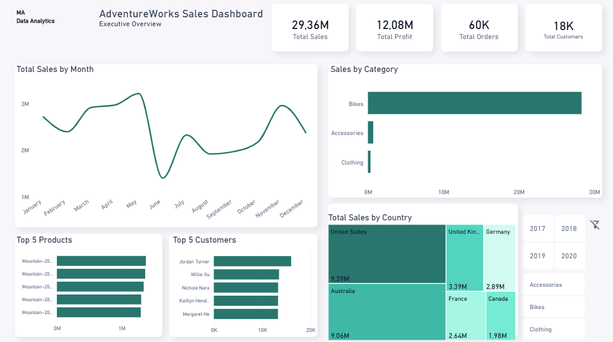

# 📊 AdventureWorks Sales Dashboard

An interactive Power BI dashboard built using Microsoft's AdventureWorks sample database to analyze sales performance, customers, products, and business metrics.

---

## 📌 Project Overview

This dashboard provides an executive overview of AdventureWorks sales performance.

The report focuses on key business metrics, sales trends, product performance, customer analysis, and geographical sales distribution through interactive visualizations.

---

## 🚀 Dashboard Features

- Executive KPI Cards
  - Total Sales
  - Total Profit
  - Total Orders
  - Total Customers

- Monthly Sales Trend Analysis

- Sales by Product Category

- Top 5 Best-Selling Products

- Top 5 Customers by Sales

- Sales Distribution by Country

- Interactive Filters
  - Year
  - Product Category
  - Reset Filters Button

---

## 🛠 Tools Used

- Power BI
- Power Query
- DAX
- AdventureWorks Sample Database

---

## 📂 Dataset

This project uses Microsoft's official **AdventureWorks** sample database.

**Source:**

https://github.com/microsoft/sql-server-samples/tree/master/samples/databases/adventure-works

AdventureWorks is a fictional bicycle manufacturing company created by Microsoft for learning SQL Server, Power BI, and Business Intelligence concepts. :contentReference[oaicite:0]{index=0}

---

## 📷 Dashboard Preview

---

## 📈 Key Insights

- Sales performance can be analyzed month by month.
- Product categories are compared based on total sales.
- Top-performing products and customers are highlighted.
- Country-level sales distribution provides geographical insights.
- Interactive slicers allow dynamic exploration of the report.

---

## 📚 Skills Demonstrated

- Data Cleaning with Power Query
- Data Modeling
- DAX Measures
- KPI Design
- Dashboard Layout Design
- Interactive Filtering
- Business Data Visualization

---

## 👤 Author

Mehmet Ateş

GitHub:
https://github.com/mehmetatesbi
